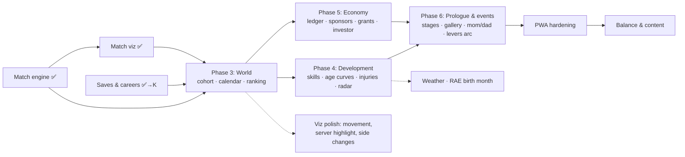

# Strategy & implementation plan

Working title: **Tennis Sim**. See [README](../README.md) for positioning, [decisions.md](decisions.md) for owner decisions, [research/](research/) for the evidence base.

## Strategy in one paragraph

Build the game the reference (Tennis Rising Star) *should* have been: the same addictive core (visible ranking climb, fast early progress, build-your-playstyle) minus the two things its players hate (ad spam, rigged outcomes), plus the two things nobody in the niche has — a watchable 2D match and the honest parent's-eye economics of raising a player. Ship as a free offline-first PWA on GitHub Pages (EN, WTA-first), grow by shareability ("look at this match" / "we went bankrupt in Bratislava"), add dormant ad-hook points and portal adapters for a later DesktopDrift-style wave.

## Architecture (fixed, framework-independent)

```
┌────────────────────────── UI (Vue 3.5 + Pinia, table screens) ─────────────┐
│  reactive VIEW-MODELS only — never the raw sim state                       │
│  Match scene: Canvas playback of a point-by-point event log                │
└───────────────▲────────────────────────────────────────────▲───────────────┘
        typed postMessage (compact deltas)          match event log (playback)
┌───────────────┴────────────────────────────────────────────┴───────────────┐
│  WEB WORKER: authoritative sim state (plain objects, non-reactive)         │
│  • engine/  pure TS, zero deps: point engine, scoring FSM, closed forms,   │
│             rally generator, development, economy, world/calendar          │
│  • db/      in-memory hot cache → dirty-flag flush → IndexedDB             │
│             (per-season records, versioned migrations, autosave slots)     │
└────────────────────────────────────────────────────────────────────────────┘
Storage adapter interface: IndexedDB (main) | portal SDKs later (≤200 KB compact state)
```

Non-negotiable invariants (from research):
- Sim never runs on the main thread or off rAF.
- `engine/` is pure and deterministic (seeded mulberry32; same seed → same career) — testable in Node, replayable, debuggable.
- A match is **an event log**; watching = playback. Skip/key-points/full are three renderings of the same log.
- Outcome math is honest and inspectable. No rubber-banding, ever.
- Money in integer cents. Save schema versioned append-only from v1.
- Every bound (world size, history retention) chosen explicitly, with pruning/aggregation for old seasons.

## Stack

Vite + TypeScript + Vue 3.5 + Pinia + vite-plugin-pwa (Workbox) + gh-pages deploy. Testing: Vitest for engine golden tests, fakeIndexedDB for db/migrations. No SharedArrayBuffer (GH Pages), no Comlink initially (raw typed postMessage protocol).

*(Owner sign-off pending on Vue vs vanilla/Svelte — see decisions.md.)*

## System dependency graph



## Phases

Sizes are relative (S < M < L), not promises. Each phase ends with something runnable/testable.

Status: Phase 0 ✅ (2026-07-22, browser-verified). Phase 1 ✅ (2026-07-22: spec [specs/phase1-match-engine.md](specs/phase1-match-engine.md), packages A/B/C via Opus subagents + TDD + architect gate; 86 tests, all calibration bands hit, 10k matches ≈ 0.72 s). Phase 2 ✅ (2026-07-22: spec [specs/phase2-match-viz.md](specs/phase2-match-viz.md), packages D/E/F — rally generation calibrated to real rally-length/DF rates, exact live win-probability DP, timeline + Canvas court, Exhibition-match screen; 128 tests, browser-gated end-to-end). UI detour ✅ (2026-07-22, owner-requested: spec [specs/detour-ui-screens.md](specs/detour-ui-screens.md) — mobile-first shell with 5 bottom tabs, 7-step onboarding wizard incl. play-style pick, landscape court, save schema v3 with PlayerProfile; browser-gated at 375 px). Package K ✅ + Phase 3 ✅ (2026-07-22/23: specs [specs/package-k-careers.md](specs/package-k-careers.md), [specs/phase3-world.md](specs/phase3-world.md) — career profiles with 2-generation autosave + recovery, cohort of 200, yearly calendar with entries/deadlines, rolling best-6 ranking, tournaments with watchable replays (~100 B each), structured events → News/Money split, month-advance with stops; schema v6, save ≈ 24 KB gzipped at week 100; 203 tests). Known Phase-4 revisits: shadow-bracket simplification (kid's bracket doesn't affect AI standings), early-season rank-milestone degeneracy (top-10 fires on a sparse week-2 ranking), rank-movement arrows need prior-week rank in Snapshot. Next: Phase 4 — development system.

### Phase 0 — Foundation (S)
Repo, Vite+TS+Vue skeleton, PWA plumbing (base path, autoUpdate), GH Pages CI, seeded RNG, worker + typed message protocol, save layer v0: IndexedDB (compressed blob per slot via CompressionStream), schema version 1 + migration harness, export/import to file, `storage.persist()` + `persisted()` surfacing.
**Exit:** empty app installs as PWA, saves/loads/exports a dummy state, deploys on push.

### Phase 1 — Match engine (M) ← the heart, built first
Pure TS: scoring FSM (games/sets/tiebreaks, Bo3), iid point model (p_A, p_B), Barnett–Clarke matchup adjustment, surface modifiers, within-match fatigue, momentum (±1–3 pp) + clutch/choke on big points, closed-form calculators (O'Malley/Newton–Keller) for instant results and AI-vs-AI fast-sim.
**Calibration harness** (Node/Vitest): batch-sim 10k+ matches, assert distributions against research bands — hold rates 75–90%, WTA p 0.52–0.62, set-score distributions, tiny-edge amplification curve.
**Exit:** engine passes golden calibration tests; CLI can sim a season of matches in milliseconds.

### Phase 2 — Match visualization (M–L) ← the hero feature
Rally generator decoupled from outcomes (length distribution ~66–70% ≤4 shots; direction priors: crosscourt ~60%, DTL ~15–20%; serve wide/body/T; 3×3 placement grid; surface shifts). Canvas top-down court: ball dot on quadratic Bezier arcs, two player markers, bounce marks in/out. Three modes: skip / key points (30–60 s) / full (2–3 min), speed control, SlamTracker-style momentum strip + live win probability, point-by-point stats. Stats must be *visible*: aces to corners, stamina fade, choking on break points.
**Exit:** a generated match between two stat blocks is genuinely fun to watch; shouts/coaching buttons stubbed.

### Phase 3 — World & career skeleton (M)
AI cohort generation (names, nations, ages, growth trajectories), weekly tick, fictional tournament pyramid mirroring reality (junior events → entry-level pro $20k/$30k analogues → challengers → tour → 4 slams), draws + entry by ranking, rolling 52-week ranking, world fast-sim via closed forms (~1000 matches ≈ 1.5 ms), player's tournament flow using Phase 2 scenes.
**Exit:** playable "hollow season" — enter events, watch matches, climb the ranking among ~200 AI players.

### Phase 4 — Development system (M)
Stat model (technical/physical/mental), potential + age curves (calibrate to real milestones: points ~17–18, top-100 ~4.5 yrs later, peak 23–28, decline ~29+), weekly training allocation, coach quality, form/condition (LEGIBLE — show the modifier pre-match), fatigue, injuries + rehab decisions, rare career-ending injury, burnout risk.
**Exit:** multi-season progression feels earned; skipping rest has consequences.

### Phase 5 — Economy & family (M)
Expense engine (coach tiers/hourly, travel by geography, entries, stringing, academy fees, physio, insurance), income engine (prize tables with the real cliff, product-then-cash sponsors, federation grants — conditional & revocable, income-share investor as a Faustian option), parent character: job/income/time budget, relationship meter; family background + start country = difficulty. Sponsor-hunt actions for parent.
**Exit:** the "valley of death" produces real dilemmas; bankruptcy is a possible (and dramatic) ending.

### Phase 6 — Childhood prologue & narrative (M)
Accelerated 5→14 prologue (quarter/year ticks, a few defining choices: first coach vs parent-coach setup, surface, school track, relocation/academy gamble) producing the starting profile; event system (conflicts, growth spurts, school, media); morale/relationship effects wired to shouts & coaching setup.
**Exit:** full career loop start-to-retirement (~16→33, ≈880 detailed weeks) playable in ~10–20 h; restart = new game or "raise a new star".

### Phase 7 — PWA hardening & saves UX (S–M)
iOS install prompt flow (7-day ITP warning for Safari-tab users), 3+ rotating autosave slots + checksums, autosave on visibilitychange/pagehide, memory audit vs ~300 MB iOS ceiling (history paged to disk), update-available flow, compact "essential career state" serialization (≤200 KB, future portal cloud saves).
**Exit:** save survives everything we can control; data-loss paths documented.

### Phase 8 — Content, balance, polish (L, ongoing)
Name/nation pools, world calendar breadth, EN copy pass, onboarding, difficulty tuning via batch-sim harness (thousands of careers overnight → survival/ranking distributions), procedural player portraits (faces.js-style), sound, juice.

### Owner-approved additions (2026-07-22 Q&A, see decisions.md)
Career profiles + new save model (Package K, before Phase 3 data). Structured events feeding News/Money/Gallery. Month fast-forward with event stops. Viz polish mini-package. Fog-of-war radar (Ph4). Relative-age-effect birth month (Ph4/6). Mom/dad choice (Ph6). Moments gallery (Ph6). Weather (Ph3/4 backlog). Replay storage (~100 B each) + share links. Spacing pass (next UI package).

### Post-v1 backlog
ATP tour (data, not code — keep everything parameterized), ad hooks at match/season end (dormant points designed in Phase 3), portal builds (CrazyGames 1 MB / Yandex 200 KB adapters; portal cloud saves optional per-portal), **optional Google Drive backup** (appDataFolder scope, client-side OAuth via Google Identity Services — opt-in "connect cloud backup" button; export/import file remains the baseline), Google Play via TWA (Bubblewrap/PWABuilder), second-child dynasty meta, share/replay links (deterministic engine makes match replays trivially shareable), RU localization.

## MVP milestone (demo-able wedge)

End of Phase 3 + thin slices of 4/5 (preset training plans, simple money counter): **"one junior season"** — pick a girl, a country, a family budget; play 52 weeks; watch matches; survive financially. If that slice is compelling, everything else is layering.

## Top risks

| Risk | Mitigation |
|---|---|
| Scope creep ("максимальная симуляция" is infinite) | Phase gates; MVP wedge; backlog discipline |
| Match viz underwhelms (hero feature) | Phase 2 right after engine; playtest the watchability early |
| iOS save loss | Install prompts, persist(), rotating slots, export/import (Phase 0, not Phase 7 afterthought) |
| Balance: realism vs fun (real attrition = 99% failure) | Difficulty presets; batch-sim tuning harness; "fair but brutal" is the brand |
| Solo-dev stamina on an L-sized project | Runnable artifact every phase; engine-first order front-loads the interesting work |
