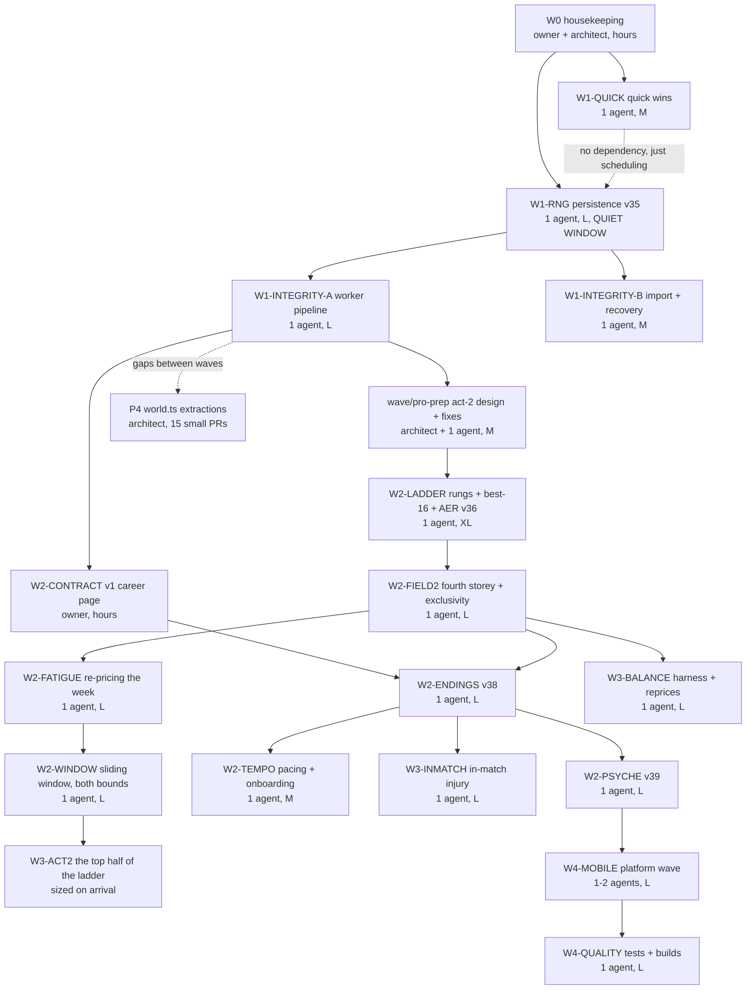

# Launch plan 2026-08 — waves, agents, and the full findings ledger

## Current truth

- This is the detailed execution companion to the canonical August roadmap.
- Wave assumptions, schema versions, and “already done” rows are dated; verify them against current
  `main` before launching work.
- Agent counts optimize elapsed time, not token consumption. Use only the parallelism justified by
  independent workstreams.

Written 01.08.2026, companion to [roadmap-2026-08.md](roadmap-2026-08.md). The roadmap says WHAT
and WHY in five phases; this document says WHO and IN WHAT ORDER: every wave as an agent
assignment with entry criteria, scope, files, exit gates and effort — and, at the bottom, the
complete findings ledger of BOTH reviews (docs/full-review P1–P9 and the Codex review TB-01..24
plus its headline P0/P1/P2 table), every row mapped to a wave, already-done, or
rejected-with-reason. Nothing from either review is left unmapped.

**How to read a wave row.** `Agents` is how many parallel builders the wave takes. `Entry` is
what must be MERGED before launch (not merely pushed). `Exit` is the wave's own gate on top of
the standing one. Effort: S <0.5d · M 0.5–2d · L 2–5d · XL >5d of agent time.

**Standing rules for every agent brief** (stated once, referenced by every wave): worktree of
its own off origin/main, one branch, push to github origin only, never main; `npm run check`
green before push, never chained onto the push; guards re-aimed with ⚠ + owner quote, never
deleted; player copy short dash – only, no Cyrillic in templates; bench before any tuning claim,
numbers in the report; schema bumps only where the wave says so, with migration + golden fixture
+ README row; the RNG regime of the moment (frozen capture 41550/e6b0c709 until W1-RNG lands,
pairwise A/B invariance after); final report verified against the brief by the architect before
it reaches the owner.

---

## The dependency graph

Parallelism at a glance: W1-QUICK can run beside W0. W1-RNG runs ALONE (quiet window). The two
INTEGRITY agents run in parallel with each other. W2-PSYCHE, W2-TEMPO and W3-INMATCH can run in
parallel after W2-ENDINGS. The LADDER→FIELD2 lane and the owner's CONTRACT page run in parallel;
both feed W2-ENDINGS. The P4 extraction lane fills every gap. (02.08: W3-FIELD is retired from
the graph — ruling 3 keeps per-season generations; its surviving scope IS W2-FIELD2. W3-BALANCE
and the P5 re-run key on W2-FIELD2 now. 03.08: W2-WINDOW enters between FIELD2 and ACT2 — rulings
11-13 make the sliding window the ladder's shape and promote ACT2 from content to structure, since
the real points curve has no source above W75 without it.)

---

## Phase 0 — W0 · Housekeeping (owner + architect, no agents, hours)

No brief — a checklist executed by hand:

1. Merge wave/2026-08-01; delete merged branches (payload-vs-origin/main check before every
   `-D`) and their worktrees.
2. **Back up `art-src/`** to cloud or external disk — the masters exist only on one laptop
   (Codex TB-24's sharpest point; the trophy incident proved the fragility class). Formal
   versioned storage comes in W4-QUALITY; the copy happens NOW.
3. Commit the Codex review onto its branch under `docs/review-codex/` (it sits as untracked
   files; both reviews claim `docs/review/`, so the path splits at commit time).
4. `npm audit` — apply the available `brace-expansion` transitive fix (Codex action #5); rerun
   the full check.
5. Close stale task-ledger rows; open rows for the waves below.

## Phase 1 — Foundations

### W1-QUICK · Quick wins (1 agent · M · entry: wave merged)

Sources: Claude P6 whole; Codex TB-19 (dev-action half), TB-22 (money half), TB-20 (theme
half); + one stowaway found by the living-field smoke.

- `src/shared/money.ts`: `formatCents`/`formatCentsSigned`; all 15 call sites converted; the
  dollars-in `formatDollars` trap dies; DRY-gate test.
- MoneyScreen reads `STARTING_FUNDS_CENTS` from the engine (hand copy deleted).
- The worker `tick` handler refuses `pendingTournament || pendingKnock` — the save-corruption
  path is closed. ⚠ The DEV gate on the button itself was landed and REVERSED the same day by
  the owner («у нас не прод и нет игроков») — the deployed build is his playtest device; the
  v-if returns the day the game has players who are not the owner.
- `test:sim` reliably green: split the reach-tracker describe, `it.each` the preset loops,
  `fileParallelism: false` for the sim project. ⚠ The weekly calibration cron first fires
  Monday 03.08 — one red run is accepted and is itself the repro; land this before the second.
- Theme sync `#0f172a` → `#0a0e13` (vite.config + index.html) + a design-tokens pin.
- **Stowaways:** the W-tier tournament header prints "Prize money –" although `prizeCents`
  exists (surfacing bug, no engine change); and the W15 lock chip prints "58 / 120 national
  pts" for a band denominated in ITF junior points — `pointsLockNote` hardcodes the domestic
  label (round-15's find).

Exit: gate + a browser pass over Money/More/Season headers; the cron's next run green.

### W1-RNG · RNG persistence, schema v35 (1 agent · L · entry: W1-QUICK merged; NOTHING else in flight)

Source: Claude P3 verbatim (its document is the brief), acknowledged by Codex ("RNG restoration
is linear in career age"). Persist `rngMain: {s, n}`; delete the per-load career replay;
migration performs the one final replay; `restoreRng` survives only as corruption recovery.
Convert the five frozen-capture suites to pairwise A/B input-independence (one informational
pin stays). Golden fixture v35. Bench: `tools/restore-bench.ts` before/after (expect O(weeks) →
O(1); the owner's Naomi save is the perfect fixture at 193 weeks).

⚠ This wave changes the REGIME every later wave works under — the quiet-window requirement is
absolute: no other engine branch may be in flight while it lands.

### W1-INTEGRITY-A · Worker pipeline (1 agent · L · entry: W1-RNG merged)

Sources: Codex TB-02 → TB-03 → TB-01 → TB-05, in that internal order, + TB-04's CAS half. All
three load-bearing claims verified against the code before adoption (load writes no autosave of
the restored state; `onerror` keeps the dead worker; handlers interleave across awaits).

- FIFO executor + monotonic `revision`; mutating requests carry `baseRevision`; typed
  `STALE_REVISION`.
- Candidate-state commit: mutate a candidate world + candidate `rngMain` (v35 made the RNG
  serializable — the reason this wave follows W1-RNG), persist save+metadata in ONE IndexedDB
  transaction, then commit memory. Injected storage failure leaves everything unchanged.
- `restoreSlot` as a distinct command: restored state becomes the newest autosave BEFORE
  success; restore → close → relaunch opens the restored state (integration-tested).
- Recoverable worker: generation tokens, per-command timeouts, terminate-and-recreate,
  "Simulation restarted from the last saved week" copy.
- Cross-tab: revision compare-and-swap at write time (the full Web-Locks lease of TB-04 is
  DEFERRED — recorded in the ledger as partially adopted).

Exit: Bundle A's own exit condition from the Codex catalogue, as tests.

### W1-INTEGRITY-B · Import hardening + storage recovery (1 agent · M · parallel with A)

Source: Codex TB-06 + the Settings-error half of TB-19. Different seam from A (saveCodec /
migrations / MoreScreen vs worker/client), hence parallel-safe.

- Size caps (compressed + expanded) before parse; full schema/range/bounds validation into
  candidate variables; commit-or-nothing.
- IndexedDB init becomes a total state transition: `loading → ready | recovery`; rejected DB
  promise resets so Retry works; visible recovery UI (retry / import / export / new career).
- Settings renders typed save/import/export errors; named-save deletion confirmed or undoable.
- Fuzz fixtures: oversized, truncated, corrupted, previous-schema.

## Phase 2 — The product spine

⚠ REVISED 02.08.2026 after the owner opened the pro-career design — the full plan is
docs/specs/act2-pro-tour.md (his eight rulings recorded there verbatim). What changed against the
original phase list: the v1 scope is the FULL career into the late thirties (ruling 5), two new
waves (W2-LADDER, W2-FIELD2) precede the endings, and the schema reservations shift by one:
**v36 = W2-LADDER (`proEntryWeeks`), v37 = W3-KIT (the kit ladder, shipped 04.08), v38 = endings,
v39 = psyche.** ⚠ The reservations shifted once already and will again — a schema number is claimed
by whichever wave LANDS, never by the plan, so this line is a record rather than a promise. W3-FIELD's «real aging/
turnover instead of the per-season re-deal» line is RETIRED by ruling 3 (per-season generations
stay); its surviving scope is folded into W2-FIELD2 below.

### W2-LADDER · The complete W ladder + the adult window (1 agent · XL · entry: wave/pro-prep merged)

Source: act2-pro-tour.md §§2–6. W50/W75/WTA 125 rungs with measured entrant bands; per-track
BEST_N (wta 16, rest 6) with a same-seeds before/after bench; the AER pro entry cap +
`proEntryWeeks` (schema v36) + the boredom-guard receipt; the two-type feed rule with
outgrown-hidden, domestic collapse, the stats archive treatment and task #77's oracle rule;
registration/cancellation letters (informational half of the entry lifecycle); the ranking-screen
window block + defending badges on event cards.

### W2-FIELD2 · The field, one storey taller (1 agent · L · entry: W2-LADDER merged)

Source: act2-pro-tour.md §8, under ruling 3 (NO stable identities — per-season re-deal stays).
The tourElite fourth storey (~64 pros, up to ~11k pts) with field-quality recalibration per rung;
week exclusivity (higher tier draws first); news stays current-season. Zero schema. The
top-of-world churn cost is accepted with a pre-scoped playtest trigger (§8 ⚠).

### W2-CONTRACT · The v1 career contract (owner, one page, hours)

Source: Codex TB-07's decision half. Full career vs honestly-marketed junior chapter; the
supported endings; epilogue evidence; the replay loop; what stays post-v1.
adult-tour-and-endings.md §4 + concept-ru.md's six finales are most of the draft — and the
02.08 rulings (act2-pro-tour.md §1) settle its biggest question: the career runs into the late
thirties. W2-ENDINGS implements against this page — it is the entry criterion.

### W2-ENDINGS · Endings, schema v38 (1 agent · L · entry: W2-CONTRACT signed, W2-FIELD2 merged)

Sources: Claude P1 verbatim (the brief), = Codex TB-07's build half; task #47. Bankruptcy with
a swept grace window, the last injury, retirement from 19, age-out, the reckoning screen off
the durable ledgers, epilogue grades. Evidence already in hand: 7/216 bench careers stranded at
18+; the P5-A cell stops entering everything by week ~167–215. `'ending'` stop reason;
`guardNotEnded` on every mutating command; `tickWeek` stays total. Bench:
`tools/endings-bench.ts`, rates in both bases, grace-N swept {4,6,8,12} against the 60–80%
survival band. README/claims rewritten to the contract (closes Codex's "docs are not a
trustworthy source" P1 for the product half).

### W2-PSYCHE · Morale + bond, schema v39 (1 agent · L · entry: W2-ENDINGS merged)

Sources: Claude P2 verbatim, = Codex TB-09 in spirit; + the ONE kernel adopted from TB-11: the
daughter's voice in the investor scene, remembered by the bond — drama without moralising, the
owner's standing ruling intact («Мы ни за что не наказываем»). Zero draws by construction;
composure factor neutral in the 40..80 band; equilibria bench-verified BEFORE any UI surfaces
them; plugs `'quit'` into W2-ENDINGS' union. Diary tone licences keyed on morale bands.

### W2-TEMPO · Pacing + truthful onboarding (1 agent · M · entry: W2-ENDINGS merged; parallel with W2-PSYCHE)

Sources: Codex TB-08 + TB-13. The third advance speed — "until the next decision" — over the
existing stop discipline, quiet weeks aggregated into one honest recap row; stop-set includes
W2-ENDINGS' terminal states (the dependency). Onboarding copy pass: every setup claim maps to a
mechanic or is labelled flavour; play-style gets zero-sum starting weights OR tendency copy
(owner picks in the brief); "All countries" → supported list; background labels rewritten as
resources/flexibility/pressure. Both reviews' claim-vs-code tables are the work list.

## Phase 3 — World depth

### W3-FIELD · RETIRED 02.08.2026 — split by the owner's ruling 3 (act2-pro-tour.md §1)

«Может быть нам не нужны стабильные как раз, а можно использовать наши генерации» — real
aging/turnover instead of the per-season re-deal is OFF the plan; per-season generations are the
architecture. What survives, and where it went: the fourth storey + week exclusivity →
**W2-FIELD2** (Phase 2); J/domestic candidate universes (the mixed-percentile trap, measured
medians 20/30 for j300/j60 fields), field-pro fatigue, pros in canonical brackets/news, name-pool
widening → **W3-ACT2's field half**, sized when act 3 opens. The P5-A re-run requirement transfers
to W2-FIELD2's exit (its spec §3 requires the second baseline before any Phase B talk).

### W2-FATIGUE · Re-pricing the week (1 agent · L · entry: W2-FIELD2 merged; runs BEFORE W2-WINDOW)

⚠ NEW 03.08 — source docs/specs/fatigue-reprice-2026-08.md, and it must land before the window
because a window she cannot walk through changes nothing. The owner: «по усталости нам надо
комплексно что-то сделать... надо все рычаги потрогать». Measured: a W35 title costs 41 and a rest
week returns 3, so the model sustains 3-15 events a season against a target of 20-30. The bill is
61% tier surcharge (charged PER match), 29% scoreline, 10% cumulative - so the surcharge is the
dial, the cumulative stays. Levers: W surcharge 4-6 → 2-3; recovery base 1 → 6-8; the six vacation
packages 12/14/16/20/25/30 → 18/22/26/32/40/48.

⚠⚠ AND THE INJURY CURVE IS RE-CALIBRATED IN THE SAME WAVE, SECOND, AFTER the fatigue re-measure -
never simultaneously, or the result is unattributable. The owner's own warning («как бы мы себе в
ногу не стрельнули усталостью») is already true on the shipped build: at the condition the current
model parks her in, a season carries a 96-98% chance of an injury against the researched 46-54%.
Acceptance is five benched numbers, spec §6.

### W3-KIT · The kit ladder + the summer block, schema v37 (1 agent · L · SHIPPED 04.08)

Owner's items 9 and 2 of the 04.08 list. Four grades per line (alloy → composite → performance →
pro) that do exactly two things and both inside the shipped wear curve: where a new one starts on
it (`startWear`) and how long it lasts (`lifeFactor`). Both axes, per his ruling («я вообще за оба
подхода одновременно, как с тренерами»): performance flows through the existing wear tables,
injury through the existing post-draw threshold multiply. Measured — realised alloy→pro swing 1.02
skill points against the 2.40 anti-destiny bound and the coach ladder's 2.26, so money buys
longevity and safety rather than a career. Bottom rung costs +11.4% weekly injury risk. Summer is
VOLUME not a multiplier (loadFactor 1.4, −3 condition, two sessions a day because there is no
school): +0.35 skill over 14→18 training-only, +0.18 racing, and a family week inside the window
costs −0.06 over a career — a trade, not a punishment. `composite` is the identity rung, so a
migrated v36 career is byte-identical.

### W2-WINDOW · The sliding window, both bounds (1 agent · L · entry: W2-FATIGUE merged)

⚠ NEW 03.08, and it displaces ruling 4's visibility rule rather than adding to it — source:
act2-pro-tour.md §11 (rulings 11–13, with the owner's own worked band table). Every rung gets a
CEILING as well as a floor, in its own table's currency; the feed shows exactly what is inside the
window; a rung she has passed CLOSES instead of being filtered.

**Acceptance — three benched numbers, not opinions** (act2-pro-tour.md §11.4):

1. **Offered**: 5–6 playable weeks of every 8 at each stage of the career — the window's own shape,
   measured per stage the way §11.1's table was.
2. **PLAYED**: 20–30 events a season on a bench career that tries to play. ⚠ THE OWNER ASKED FOR
   THIS ONE EXPLICITLY, and it is the criterion that cannot be faked by widening a window: today
   his own career plays **11 events in 52 weeks** — half his target and half what a real top-100
   plays (20–25). A window she cannot walk through because fatigue or the wallet says no is a
   window that changed nothing, and only this number notices.
3. **Paced**: reaching the top of what exists takes as long as it does in life — no clearing the
   shipped ladder inside two seasons.

⚠ If (2) cannot be reached without loosening fatigue or the travel economics, STOP and report the
numbers rather than tuning either: both were measured for the junior era and the owner priced them
himself. What the pro era should cost is his call, and it is a different question from the window.

### W3-ACT2 · The top half of the ladder (entry: W2-ENDINGS + W2-WINDOW merged; sized on arrival)

⚠ PROMOTED 03.08 FROM CONTENT TO STRUCTURE (act2-pro-tour.md §11.3). With the real points-to-rank
curve settled, 250 / 500 / 1000 / Slams stop being "more tournaments later": they are the only
source of the points that curve is made of, the only thing that fills the window above W75 (which
measures 2.2 playable weeks of 8 today), and the home of the mandatory regime. The shipped ladder's
mathematical ceiling is ~1,500 points ≈ real #45 — v1 is therefore the honest climb to the edge of
the real top-100, and this wave is what opens the rest.

Source: act2-pro-tour.md §§6–9 + §11.3. Named calendar anchors (Slams at fixed season weeks,
1000s/500s), the mandatory regime for top-50 with zero-point counted slots, the penalty ledger
(10 pts/52wk → 4-week suspension) with letters at every step, sponsors premium/icon + appearance
fees, big draws (48/96/128 — sim cost and Draw-view are the priced unknowns), merited AER
increases, and the W3-FIELD leftovers above.

### W3-INMATCH · The in-match injury (1 agent · L · entry: W2-ENDINGS merged — the last-injury ending is the consumer)

Source: the owner, 01.08 («может получить травму прямо в процессе матча, интересно!»). NEW —
neither review saw it. Today an injury rolls once per week at the top of the tick, BEFORE the
tournament: a play-week injury is a walkover and the player never sees a moment. The design:

- The weekly injury BUDGET stays (season rates must not move — bench-pinned): on a competition
  week the same probability decides, on the event's own sub-stream, whether the injury fires
  IN-RUN — and if so, in which match, at which point.
- The run truncates: that match becomes a retirement ("ret." at the stored score), remaining
  rounds a withdrawal, finish = that round's loss (wave-B points rules unchanged).
- Match records gain optional `{retiredAt, retiredBy}` — optional-additive on a persisted type,
  NO schema bump (the v32 precedent).
- MatchViewer stops playback at the point and says it; the box score marks ret.; the reveal
  flow hands off to the existing InjuryStopDialog; the layoff machinery is unchanged
  downstream.
- Inputs stay the rich ones that already exist (condition, clearance 'warn', the knock's
  weakened part, kit wear) — the slice moves WHEN, not WHETHER.
- Phase 2 of the slice (cheap, later): the OPPONENT can retire — she advances.

Cost honestly: engine M (onset + truncation + finalize), viz M (the viewer/commentary/box-score
half is the bigger part), balance S (rate parity bench), tests M (injury suites + private
`:injury:` stream pins re-aimed with ⚠). Total L. The dramatic payoff is outsized: the game's
stated differentiator is the watchable match, and this puts its worst moment on screen instead
of eating it silently before the trip.

### W3-BALANCE · The balance harness + reprices (1 agent · L · entry: W2-FIELD2 merged)

Sources: Codex TB-14 + roadmap items 11–12 + P5-A's quantified finding.

- One versioned deterministic harness folding the bench fleet (econ/fatigue/field-quality/
  dual-universe) into a machine-readable artifact per release candidate; bands with tolerances;
  `creditNonPlayingRecovery` extracted (the known skip-week accident becomes an intended rule).
- W fatigue re-priced against REAL fields (the round15 numbers are explicitly priced for soft
  fields; the code carries the note).
- The champion-news contradiction (announced ≠ paid in ~91% of her played events): present the
  owner both options with both baselines — teach the news to speak about two tables honestly,
  or reopen P5 Phase B against its pre-registered threshold on the new data.
- #53 (who reaches the elite) measured together with the National ceiling and the brand-deal
  condition.

### W3-LATER · Weather #67 · Prologue #71

Owner-sequenced («финалы, а пролог после них»): the prologue waits for W2-ENDINGS; weather is
free-standing (the WeatherPlate contract was built for exactly this swap). Briefs exist in the
task ledger; scheduled when the owner calls them.

## Phase 4 — Platform quality

### W4-MOBILE · The mobile platform wave (1–2 agents · L · entry: Phase 2 merged)

Sources: Claude P8 (safe areas, system back, dialog semantics) enriched with Codex TB-15/16/17/18
where sharper — Codex's inventory of exact offending selectors (the flat 24px `--app-pad-top`,
the heroes' `top: 20px` chrome, `.tf-top`'s flat 16px, the three floating CTAs anchored at the
tab bar's height WITHOUT its safe-area padding) is the work list. One `DialogShell` (native
`<dialog>` preferred) migrated flow-by-flow, critical reports non-dismissible; history-mapped
navigation for the stable screens, back closes the topmost surface; `aria-current`, one h1 per
screen, throttled match live region + static result line (TB-17); 320px calendar,
40–44px targets, the dim-token contrast promotion (TB-18). If two agents: shell+navigation /
geometry+screens split.

### W4-QUALITY · Tests, lint, assets, releases (1 agent · L · entry: W4-MOBILE merged)

Sources: Claude P9 + Codex TB-23 + TB-24's second half + TB-20.

- BOTH UI test layers (the reviews chose different ones; both won): five mounted component
  smokes (happy-dom) AND 10–15 Playwright+axe journeys at four widths. No DOM snapshots; no
  formatting lint — the twin rules both reviews arrived at protecting the source-pin corpus.
- ESLint flat config, correctness-only; coverage report; the `vue/return-in-computed-property`
  catch fixed.
- Asset diet (~1 MB: icon recompression, the zero-consumer logo dropped); audio cache policy
  (music is currently deferred by licence — the policy ships with the toggle);
  release discipline: tags, CHANGELOG, build id in About (a bug report can name a build).
- Pure builds: `art:ingest`/`art:optimize` split (build never mutates the authoring tree),
  masters' versioned storage formalised, pinned toolchain, release checklist.

### P4 · world.ts decomposition — the standing background lane (architect, 15 small PRs)

Claude P4's mechanical recipe under Codex TB-21's sequencing rule (which won): only after
W1-INTEGRITY, one extraction per gap between waves, never concurrent with a feature wave in the
same region, each PR individually green with zero behaviour change. The condition.ts recipe,
15 times, ending with world.ts as a pure barrel.

## Phase 5 — The commercial track (owner-led)

The Codex funding roadmap chapter is the reference document; its "investor objections" list is
closed almost line-for-line by Phases 1–2, which is the plan's central economy: **the
investor-ready slice is not a separate programme — it is Phases 1–2 finished.** The owner's
gates, in the roadmap's own order: entity/chain-of-title (the art manifest's five pending
attestations are on this list), the desktop packaging spike, the Steam page + demo plan, the
staged financing (bridge → project/publisher). Engineering feeds it; decisions are the owner's.

---

## The findings ledger — every review item, mapped

Status legend: ✅ done (merged or in wave/2026-08-01) · 🔜 mapped to a wave above ·
✂ adopted partially (what and why) · ✋ rejected (why) · 👤 owner decision.

### Claude review (docs/full-review, P1–P9)

| ID | Item | Status |
|---|---|---|
| P1 | Career endings + reckoning | 🔜 W2-ENDINGS |
| P2 | Morale + bond (pillar 3) | 🔜 W2-PSYCHE |
| P3 | RNG persistence v35 | 🔜 W1-RNG |
| P4 | world.ts split, 15 extractions | 🔜 P4 lane (Codex's timing rule adopted) |
| P5 | Dual-universe: bench then maybe pay one universe | ✅ Phase A shipped, verdict NOT material; Phase B closed; re-run required after W2-FIELD2 (its spec §3; transferred 02.08 when W3-FIELD was retired) |
| P6 | Quick wins (money/dev-gate/sim-CI/theme) | 🔜 W1-QUICK |
| P7 | Legal & provenance | ✅ shipped in this wave (5 manifest attestations = owner's merge gate) |
| P8 | Mobile wave | 🔜 W4-MOBILE |
| P9 | Quality infrastructure | 🔜 W4-QUALITY |

### Codex review (TB-01..24)

| ID | Item | Status |
|---|---|---|
| TB-01 | Durable restore | 🔜 W1-INTEGRITY-A (claim verified in code) |
| TB-02 | FIFO + revisions | 🔜 W1-INTEGRITY-A (verified) |
| TB-03 | Transactional mutate+persist | 🔜 W1-INTEGRITY-A (sequenced after W1-RNG for the serializable RNG) |
| TB-04 | Cross-tab ownership | ✂ CAS half into W1-INTEGRITY-A; full Web-Locks lease deferred — phone-first single-player, CAS closes the data loss |
| TB-05 | Recoverable worker | 🔜 W1-INTEGRITY-A (verified: dead worker stays cached) |
| TB-06 | Import hardening + storage recovery | 🔜 W1-INTEGRITY-B |
| TB-07 | v1 career contract | 🔜 W2-CONTRACT (decision) + W2-ENDINGS (build) |
| TB-08 | Safe time compression | ✂ "until next decision" mode into W2-TEMPO; the "hundreds of mandatory one-week advances" framing corrected (+4 with stop rules exists) |
| TB-09 | Daughter agency spine | ✂ into W2-PSYCHE (two variables + voice, not the full preference/consent simulator — Claude P2's smaller shape won; TB-09's age-graded autonomy is its phase 2) |
| TB-10 | Parent work-vs-presence economy | 👤 owner decision, post-Phase-2 — a real pillar-3 extension, but new weekly choice load; revisit with W2-PSYCHE's bench in hand |
| TB-11 | Ethical investor redesign | ✂ the daughter's voice + bond memory into W2-PSYCHE; the moralising/sensitivity-pass framing rejected — the owner's design ruling stands (a lever, never a punishment) |
| TB-12 | Match interaction contract | 👤 owner decision; the recommended observational contract is today's reality — the adoptable half (pre-match evidence card, honest shout labels, post-match inference note) slots into W4-MOBILE's screens pass or a small wave of its own |
| TB-13 | Truthful onboarding | 🔜 W2-TEMPO |
| TB-14 | Executable balance contracts | 🔜 W3-BALANCE |
| TB-15 | Modal/sheet foundation | 🔜 W4-MOBILE |
| TB-16 | Platform navigation | 🔜 W4-MOBILE |
| TB-17 | Semantic status/narration | 🔜 W4-MOBILE |
| TB-18 | Mobile geometry | 🔜 W4-MOBILE |
| TB-19 | Safe Settings | ✂ dev-action + error surfacing into W1-QUICK / W1-INTEGRITY-B; the rest rides W4-MOBILE |
| TB-20 | Offline media policy | 🔜 W4-QUALITY (trophies/sponsors cache split already shipped in fix/trophy-masters) |
| TB-21 | Engine decomposition | 🔜 P4 lane |
| TB-22 | Store/format/UI consolidation | ✂ money half into W1-QUICK; store-mutation helper + option-group into W4-QUALITY |
| TB-23 | Risk-shaped test pyramid | 🔜 W4-QUALITY (+ its persistence tests inside W1-INTEGRITY) |
| TB-24 | Pure builds, backed assets, governance | ✂ licence half ✅ (P7); masters backup → W0 now + W4-QUALITY formal; build purity → W4-QUALITY |

### Codex headline findings not fully covered by a TB row

| Finding | Status |
|---|---|
| P0 "hundreds of mandatory one-week advances" | ✂ W2-TEMPO (framing corrected) |
| P1 "docs are not a trustworthy source of truth" | 🔜 W2-ENDINGS (README/product claims) + P4 lane (historical comments → ADRs) |
| P1 `▶▶ 52 (dev)` ships in prod | 🔜 W1-QUICK |
| P1 sim CI red-on-green | 🔜 W1-QUICK (cron note: first firing 03.08 accepted red) |
| P2 build mutates authoring tree / masters unbacked | 🔜 W0 (backup now) + W4-QUALITY (purity) |
| 48h item: `brace-expansion` audit fix | 🔜 W0 |
| Funding roadmap (ch. 10) | 👤 Phase 5 reference document |

### Found by our own work this week (neither review)

| Finding | Status |
|---|---|
| The W15 field was mid-table juniors; P(title) 83% | ✅ living-field phase W (20.5%) |
| On-ramp ratchet (209/216 locked out) | ✅ v34 latch, merged |
| Champion-news ≠ paid champion in ~91% of her events | 🔜 W3-BALANCE (owner decision with both baselines) |
| "Prize money –" on W-tier headers | 🔜 W1-QUICK stowaway |
| In-match injury does not exist | 🔜 W3-INMATCH (the owner's 01.08 ask) |
| `pointsLockNote` names the wrong currency on W15 locks | 🔜 W1-QUICK stowaway (round-15's find) |
| `activeLadderOf` never returns 'wta' — no surface auto-opens on the professional table | 👤 with W2-CONTRACT: WHEN the pro table becomes "her" table is the handover-at-19 question |
| `bench:fatigue --scenario runfat-*` patches only the C-family run ladder | 🔜 W3-BALANCE (the harness consolidation absorbs it) |
| Academy travelCover 0.75: safety gate passed (backed 27-30/30 unchanged) but long-horizon trip volume thins (j30 entries 55→45 over 14→20; worst working reach cell 24→16/30 at 14→18) | 👤 the size is the owner's call — 0.75 ships in the wave, the measured cost is on the table |
| Trophy twin-masters / delivery door / 60-day cache | ✅ fix/trophy-masters |
| Practice button lost its pre-match screen | ✅ fix/practice-prematch |

---

## Effort summary

| Phase | Agent-waves | Serial path | Parallelizable |
|---|---|---|---|
| 0 | 0 (hands) | hours | — |
| 1 | 4 | W1-QUICK → W1-RNG → INTEGRITY-A | INTEGRITY-B beside A |
| 2 | 3 + owner page | CONTRACT → ENDINGS → PSYCHE | TEMPO beside PSYCHE |
| 3 | 3 (+2 later) | FIELD → BALANCE | INMATCH beside FIELD/PSYCHE |
| 4 | 2–3 | MOBILE → QUALITY | P4 lane in every gap |

The serial spine is: quick wins → RNG → integrity → contract → endings → psyche/field →
balance → mobile → quality. Roughly ten agent-waves of L/M size plus the extraction lane — at
the cadence this project has actually sustained (two to four agent-waves a week), Phases 1–2,
the investor-relevant core, are a two-to-three week horizon of real work, not a quarter.
