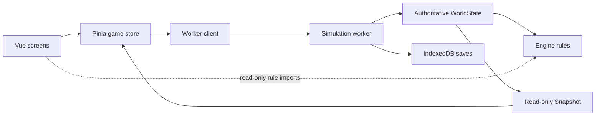

# Architecture and Data Review

## Verdict

The architectural idea is sound: the UI sends commands to an authoritative simulation in a Web Worker, and receives immutable presentation snapshots. That is a better foundation than most games at this stage. The implementation does not yet preserve that model under concurrency, storage failure, worker failure, multiple tabs, or restore workflows. Those are correctness defects, not theoretical scaling concerns.

## Current shape

The intended write boundary is clear. Some screens nevertheless import engine and world helpers directly—for example planning, tier, history, and match UI—which couples the browser bundle to simulation details even when the imports are read-only.

## What is strong

- A worker isolates heavy simulation work and gives the engine one conceptual authority.
- Typed request/response messages and strict TypeScript make the boundary discoverable.
- Deterministic, purpose-separated randomness is unusually disciplined.
- Two autosave generations, checksums, migrations, bounded history ledgers, and dedicated migration tests show serious attention to save durability.
- IndexedDB keeps personal data local; there is no remote telemetry or account dependency.
- Plain functions and data structures keep engine code debuggable and portable.

## Release-level correctness findings

### P1 — Restore does not durably replace the active career

The Settings copy promises that restoring a previous save replaces current progress, but the worker's load path reads the chosen record, restores it in memory, and returns a snapshot without committing that state as the newest autosave. On the next launch, startup selects the most recent autosave; closing immediately after a restore can therefore bring back the progress the player believed they replaced.

Evidence: [`MoreScreen.vue`](../../src/components/screens/MoreScreen.vue), [`sim.worker.ts`](../../src/worker/sim.worker.ts), and [`game.ts`](../../src/stores/game.ts).

Implement a distinct `restoreSlot` transaction that validates the chosen state, establishes it as the new active revision, and writes a fresh autosave before reporting success. Add a restart-after-restore integration test.

### P1 — Commands are correlated, but not serialized

The client posts every request immediately. The worker's async message handler can process multiple messages against shared `world` and RNG globals at once. A mutation can pause during persistence while another command mutates the same state. Consequences include responses representing the wrong revision and concurrent autosaves selecting the same generation.

Evidence: [`client.ts`](../../src/worker/client.ts) and [`sim.worker.ts`](../../src/worker/sim.worker.ts).

Put all commands through a worker-side FIFO queue. Give every committed world a monotonic revision, require a command's base revision to match, and include the resulting revision in every response.

### P1 — An autosave failure leaves an invisible successful mutation

Many commands mutate `world` and RNG before awaiting autosave. If persistence fails, the UI receives an error and retains its old snapshot, but the worker retains the mutation. Retrying can apply an action twice, and a later save can include the supposedly failed action.

Apply a command to a candidate state and serializable PRNG state, validate it, persist it, then atomically make it current. If a full candidate-state design is deferred, return the mutated snapshot with an explicit `dirty` persistence state; never imply that the action failed when it actually ran.

### P1 — Multiple tabs can overwrite each other

Every tab owns an independent worker and in-memory world while sharing one IndexedDB. There is no cross-tab lock, revision comparison, or broadcast. A stale tab can overwrite newer progress, and can potentially recreate a career another tab deleted.

Use a per-career Web Lock where available, backed by a revision compare-and-swap at write time. Make secondary tabs read-only or require a deliberate takeover, and use `BroadcastChannel` to notify them of new revisions and deletion.

### P1 — A worker crash permanently wedges the client

The error handler rejects pending requests but keeps the dead worker reference. Future calls reuse it. There is also no response timeout or `messageerror` recovery.

On worker error, terminate it, clear the reference, reject pending calls with a typed recoverable error, and recreate on the next request. Add timeouts and a worker-generation token so a late response cannot satisfy a request from a replacement worker.

### P1 — Storage initialization can leave the app loading forever

Initial persistence and refresh work occurs outside the store's usual error wrapper. If opening IndexedDB fails, `ready` may never be set. The cached database-opening promise can also remain rejected until a page reload.

Make initialization a total state transition: `loading -> ready | recovery`. Reset a rejected database promise, expose retry/export/recovery options, and always leave the splash/loading state.

## Important hardening work

### Save imports need complete validation and resource limits

Migration ends with only shallow checks such as seed, week, and profile. The export header contains schema information that decode does not rely on, and import assigns global state before every restoration step has succeeded. There are no compressed or expanded size caps.

Treat imports as untrusted local input:

1. Enforce compressed and expanded byte limits before parsing.
2. Validate the complete schema, numeric ranges, enum values, array bounds, and ledger limits.
3. Decode and restore into local candidate variables.
4. Commit globals only after every step succeeds.
5. Fuzz malformed, truncated, oversized, and previous-version saves.

This is primarily resilience against corrupt files and local denial of service, not evidence of a remote exploit.

### RNG restoration is linear in career age

Load recreates the PRNG by replaying ticks up to the saved week. Load time therefore grows with the career, and a future change to random-call order threatens compatibility. Persist the PRNG's explicit state or counter in a new schema version and migrate older saves once.

### Save and metadata writes are not one transaction

Career metadata and save records can diverge because they are written separately, and request success is treated as transaction success. Write both stores in one IndexedDB transaction and resolve only on transaction completion.

### The worker boundary leaks into the UI bundle

Direct imports of engine helpers from UI code are currently read-only, but they weaken ownership and duplicate rule code in the main bundle. Move stable display rules into a small shared/presentation package or include derived values in snapshots. Do not expose mutable world types to UI code.

### Navigation has outgrown a single ref

Avoiding a router was sensible KISS at the prototype stage. The app now has ten screen states, nested market and match flows, custom origins, and no browser history or deep links. Either adopt a lightweight router/History API mapping or formalize a navigation service with a stack, focus/scroll restoration, titles, and back semantics.

## Module boundaries

`world.ts` is about 5,300 lines and `protocol.ts` about 1,600. They mix orchestration, domain rules, persistence-facing shapes, snapshot projection, and historical rationale. Large files are not inherently wrong; these files are problematic because unrelated changes collide in the same state and command surfaces.

A safe decomposition is evolutionary:

- Keep one `WorldState` aggregate and one command entry point.
- Extract command handlers by lifecycle: planning, weekly advancement, tournaments, offers, health, and endgame.
- Extract pure projection functions for ladder, finances, calendar, and player display.
- Separate versioned persistence DTOs from runtime world types and UI snapshots.
- Keep cross-module invariants in one explicit `validateWorld()` function.

Do not rewrite the engine into services or classes wholesale. First install serialization, revision, and persistence invariants; then move pure functions without changing behavior.

## Required invariants

The architecture should make these properties executable:

- Exactly one mutation is evaluated per career revision.
- A reported success is durably stored, or explicitly reported as unsaved.
- A reported failure does not change the authoritative world.
- A restore remains active after immediate close and restart.
- A stale tab cannot overwrite a newer revision.
- Import either commits one fully valid world or commits nothing.
- Worker loss is recoverable without reloading the page.
- Every snapshot is derived once from one committed world revision.

These are higher priority than splitting files or adopting additional libraries.
